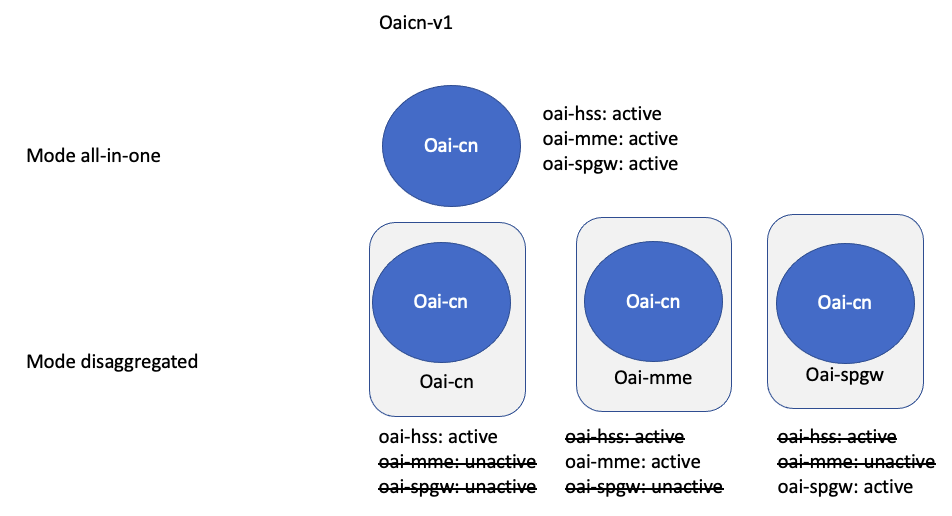

# kube5g demo on R2lab

This **kube5g.py** script aims to demonstrate how to automate a 4G deployment on R2lab
using both nepi-ng and a kubernetes operator.

Kube5g stands for [Cloud-Native Agile 5G Service Platforms](https://mosaic5g.io/kube5g/),
developed at Eurecom.

_Acknowledgments: Support regarding the Kubernetes **k5goperator** has been provided by
Osama Arouk at Eurecom <osama.arouk@eurecom.fr>._

## the different steps

### metal provisioning

First, the nepi-ng **kube5g.py** script will deploy a Kubernetes (k8s) infrastructure on
the R2lab testbed. By default, 4 fit nodes will be used :

* one master k8s node (fit01)
* and 3 worker k8s nodes (fit02, fit03 and fit23)

Of course these defaults can be overridden on the command line.

### orchestrating the k8s cluster

Once the k8s nodes are ready, the kube5g.py script will install the kube5g operator
(called **k5goperator**) on the master node.

This operator is responsible for launching the different OpenAirInterface VNFs to deploy
the different pieces of a 4G network. The `kube5g.py` script will first apply
configuration parameters specific to R2lab (such as the DNS IP address or some RAN
parameters for the eNB). Then it will apply to the operator the CRD (custom resource
definitions) corresponding to the 4G scenario to deploy. Afterwards, the kube5g operator
is started and it will run on the worker nodes the different VNFs corresponding of the 4G
scenario selected.

Two versions of the core network (CN) are possible:

* v1: the CN is implemented with one VNF called **oai-cn** that includes the different 4G
  functions (hss, mme, spgw)

  

* v2: the CN is implemented with multiple VNFs (**oai-hss**, **oai-mme**, **oai-spgwc**,
  **oai-spgwu**)

  

And for both versions, it is possible to run them in two modes (*all-in-one* (all in the
same pod) or *disaggregated* (each VNF in a different pod).

> Note: you select between both versions of the operator with  
> `kube5g.py -Ov1` or   
> `kube5g.py -Ov2`  
> with `kube5g.py -Onone`, `kube5g.py` will not start the operator, so you can run it
> yourself interactively from the master node

> Note: in v1 or v2 mode, the default is tho use the *all-in-one* mode,
> you can turn on disaggregated modes with  
> `kube5g.py -D`

Depending on the scenario, it takes between 1mn and 3mn for the operator to deploy the
network, including the eNB (with the **oai-ran** VNF). The **k5goperator** operator
integrates the scheduler that will decide in which worker node to run each pod, based on
some labels (used for both pods and nodes). For instance, the oai-ran pod must be deployed
on a specific node that corresponds to the machine connected to the USRP (B210) configured
with the eNB duplexer.

Once the network is deployed, the nepi-ng script will switch on phones and will test the
4G connection with a speedtest.

It is then possible to log on the worker node and modify manually some configuration
parameters or launch a new 4G scenario on top of the k8s/R2lab platform.

Note that using the **kube5g.py** option `-K none`, the script will only deploy k8s and
the **k5goperator**, and let the user manually start the 4G scenario it prefers, possibly
after tuning the configuration parameters.

## Playing with the k5goperator

Log on the master node (from the **faraday** R2lab gateway, `ssh root@fit01`)

Then, with alias k=kubectl, first cd to the operator directory

```bash
cd ~/kube5g/openshift/kube5g-operator
```

### List the k8s master and worker nodes

```bash
root@master-node:~/kube5g/openshift/kube5g-operator# k get no
NAME          STATUS   ROLES    AGE   VERSION
fit02         Ready    <none>   55m   v1.19.4
fit03         Ready    <none>   55m   v1.19.4
fit23         Ready    <none>   55m   v1.19.4
master-node   Ready    master   56m   v1.19.4
```

### List the k8s kube5g/OAI pods

```bash
root@master-node:~/kube5g/openshift/kube5g-operator# k get po
NAME                               READY   STATUS    RESTARTS   AGE
kube5g-operator-8c5c9bd5f-qd4sb    1/1     Running   0          55m
mosaic5g-mysql-7684777595-dwl4x    1/1     Running   0          47m
mosaic5g-oaicnv1-75f48f944-xlbbm   1/1     Running   0          47m
mosaic5g-oairan-6876b74d4c-2ckpl   1/1     Running   0          46m
```

### Bring the v1 all-in-one network down

```bash
k delete -f deploy/crds/cr-v1/lte-all-in-one/mosaic5g_v1alpha1_cr_v1_lte_all_in_one.yaml
```

### Remove the kube5g-operator

```bash
./k5goperator.sh container stop
```

### Launch the v1 disaggregated 4G scenario

```bash
./k5goperator.sh deploy v1 disaggregated-cn
```

### Ssh in a pod

Ge the name on the pod through `k get po`, then for instance, to log on the **oai-ran** pod and check the log:

```bash
root@master-node:~/kube5g/openshift/kube5g-operator# k get po|grep ran
mosaic5g-oairan-6876b74d4c-wspmh      1/1     Running   0          2m27s
root@master-node:~/kube5g/openshift/kube5g-operator# k exec -it mosaic5g-oairan-6876b74d4c-wspmh -- bash
root@ubuntu:/# oai-ran.enb-journal -r |head
-- Logs begin at Fri 2020-11-20 15:39:45 UTC, end at Fri 2020-11-20 15:40:48 UTC. --
Nov 20 15:40:38 ubuntu oai-ran.enbd[969]: [ENB_APP]   TYPE <CTRL-C> TO TERMINATE
Nov 20 15:40:38 ubuntu oai-ran.enbd[969]: [LIBCONFIG] MCEs.[0]: 1/1 parameters successfully set, (1 to default value)
Nov 20 15:40:38 ubuntu oai-ran.enbd[969]: [LIBCONFIG] MCEs.[0]: 1/1 parameters successfully set, (1 to default value)****
```

### Change a parameter in the CRD and apply it

Make your change on the CRD file, and then run the command below. The current deployment (if any), will be stopped and a new one will be started with the modified CRD. Following example corresponds to the v1 disaggregated scenario :

```bash
# edit the file deploy/crds/cr-v1/lte/mosaic5g_v1alpha1_cr_v1_lte.yaml
k apply -f deploy/crds/cr-v1/lte/mosaic5g_v1alpha1_cr_v1_lte.yaml
```

Nota: hopefully, soon it should be possible to use the `k edit -f file` command (fix TBD on **k5goperator**).

### Remove CRDs

```bash
./k5goperator.sh -c
```

### Test the network with R2lab phones

You can use the two android phones available on R2lab. They are controllable through the macphone1 and macphone2 hosts with the following commands:

* `phone-off` to switch on the air-plane mode
* `phone-on` to switch off the air-plane mode
* `phone-check-cx` to show the current network state along with the phone IP address
* `phone-reset` to reset the telephone with the default parameters; this takes about 2mn.
